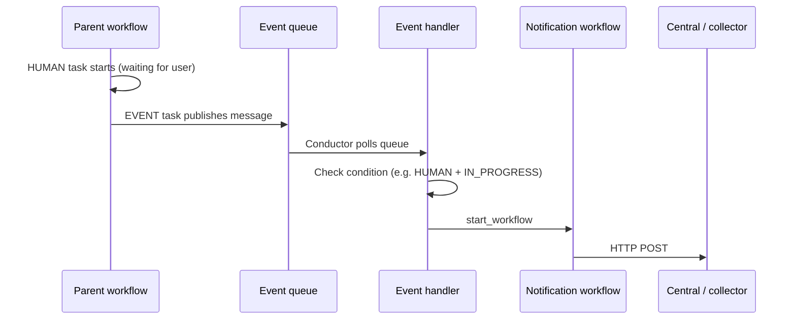

# Simple Task Notifications — Event Handler + HTTP Workflow

A workflow-only way to notify Central with the same payload shape as native SIMPLE task events (e.g. when a HUMAN or other system task needs attention).

---

## Idea in one sentence

**Parent workflow publishes an event → Event handler starts a small notification workflow → HTTP task POSTs to Central.**

No code changes in Conductor core. Everything is defined via workflows + one event handler.

---

## How it works



---

## Three things to register

| # | What | Purpose |
|---|------|---------|
| 1 | **Parent workflow** | Runs HUMAN + EVENT task that publishes the message |
| 2 | **Notification workflow** | One HTTP task that POSTs to Central |
| 3 | **Event handler** | Listens on the event queue and starts the notification workflow |

**Order:** Register (1) and (2) first, then (3).

---

## 1. Parent workflow (publish the event)

Use **FORK** so HUMAN and EVENT run in parallel:

- **Branch A:** HUMAN task (waits for approval)
- **Branch B:** EVENT task (publishes notification)

```json
{
  "name": "HumanTaskWorkflow",
  "version": 1,
  "ownerEmail": "you@example.com",
  "schemaVersion": 2,
  "inputParameters": ["accountId"],
  "tasks": [
    {
      "name": "fork_human_and_notify",
      "taskReferenceName": "fork_human_and_notify",
      "type": "FORK_JOIN",
      "forkTasks": [
        [
          {
            "name": "human_ref",
            "taskReferenceName": "human_ref",
            "type": "HUMAN",
            "inputParameters": {
              "accountId": "${workflow.input.accountId}"
            }
          }
        ],
        [
          {
            "name": "notify_ref",
            "taskReferenceName": "notify_ref",
            "type": "EVENT",
            "sink": "conductor:simple_task_notify",
            "startDelay": 1,
            "inputParameters": {
              "taskType": "HUMAN",
              "status": "IN_PROGRESS",
              "taskRefName": "human_ref",
              "taskId": "${human_ref.taskId}",
              "accountId": "${workflow.input.accountId}"
            }
          }
        ]
      ]
    },
    {
      "name": "join",
      "taskReferenceName": "join",
      "type": "JOIN",
      "joinOn": ["human_ref", "notify_ref"]
    }
  ]
}
```

**Important:** The EVENT `sink` is prefixed with the parent workflow name by Conductor. Use `conductor:simple_task_notify` in the EVENT task; the handler listens on:

```
conductor:HumanTaskWorkflow:simple_task_notify
```

---

## 2. Notification workflow (HTTP → Central)

```json
{
  "name": "simple_task_notification_workflow",
  "version": 1,
  "ownerEmail": "you@example.com",
  "schemaVersion": 2,
  "inputParameters": ["accountId", "workflowId", "taskId", "taskRefName", "taskStatus", "taskType"],
  "tasks": [
    {
      "name": "post_to_central",
      "taskReferenceName": "post_to_central",
      "type": "HTTP",
      "inputParameters": {
        "http_request": {
          "uri": "https://<central-host>/<endpoint>",
          "method": "POST",
          "contentType": "application/json",
          "headers": {
            "Authorization": "Bearer ${CENTRAL_AUTH_TOKEN}"
          },
          "body": {
            "account_id": "${workflow.input.accountId}",
            "payload_type": "conductor_task_status",
            "payload_version": "1.0",
            "payload": {
              "workflowId": "${workflow.input.workflowId}",
              "taskId": "${workflow.input.taskId}",
              "referenceTaskName": "${workflow.input.taskRefName}",
              "status": "${workflow.input.taskStatus}",
              "taskType": "${workflow.input.taskType}"
            }
          }
        }
      }
    }
  ]
}
```

**Auth note:** `${CENTRAL_AUTH_TOKEN}` is resolved from a process env var on the Conductor server. It is not read from `application.properties` unless also exposed as an env var.

---

## 3. Event handler (glue)

```json
{
  "name": "simple_task_notification_handler",
  "event": "conductor:HumanTaskWorkflow:simple_task_notify",
  "condition": "$.taskType == 'HUMAN' && $.status == 'IN_PROGRESS'",
  "actions": [
    {
      "action": "start_workflow",
      "start_workflow": {
        "name": "simple_task_notification_workflow",
        "version": 1,
        "correlationId": "${workflowInstanceId}",
        "input": {
          "workflowId": "${workflowInstanceId}",
          "taskRefName": "${taskRefName}",
          "taskId": "${taskId}",
          "taskStatus": "${status}",
          "taskType": "${taskType}",
          "accountId": "${accountId}"
        }
      }
    }
  ],
  "active": true
}
```

| Field | Meaning |
|-------|---------|
| `event` | Must match EVENT task `sink` |
| `condition` | Filters messages (`$.field` syntax) |
| `start_workflow.input` | Maps event payload → notification workflow input (`${field}`) |

---

## Where events are stored

Internal `conductor:` events use the same **`QueueDAO`** as worker/decider queues:

| `conductor.db.type` | Event queue backend |
|---------------------|---------------------|
| `postgres` | **Postgres** (poll) |
| `redis_standalone` | **Redis** (poll) |

This is **not** in-memory pub-sub. Postgres + Redis containers running together does not mean both are used — only the configured backend is used.

**Not supported:** Postgres for DB + Redis for queues only (requires custom code).

---

## API quick reference

| Action | Endpoint |
|--------|----------|
| Register workflow | `POST /api/metadata/workflow` |
| Register event handler | `POST /api/event` |
| Start parent workflow | `POST /api/workflow/HumanTaskWorkflow` |
| Complete HUMAN task | `POST /api/tasks` |
| List event handlers | `GET /api/event` |

---

## Code path (for debugging)

| Step | Class |
|------|-------|
| EVENT publishes | `core/.../execution/tasks/Event.java` |
| Queue poll | `core/.../events/queue/ConductorObservableQueue.java` |
| Handler listens | `core/.../events/DefaultEventQueueManager.java` |
| Message processed | `core/.../events/DefaultEventProcessor.java` |
| `start_workflow` action | `core/.../events/SimpleActionProcessor.java` |
| HTTP call | `http-task/.../HttpTask.java` |

---

## Pros & cons

| Pros | Cons |
|------|------|
| No core code changes | Must add EVENT + fork to each HUMAN workflow |
| Per-workflow control | Auth token via env var or workflow input |
| Fire-and-forget to Central | Payload built manually |
| Easy to test with httpbin | Extra workflow instance per notification |

---

## Simpler alternative (code change)

Enable **`TaskStatusPublisher`** and call `notifyTaskStatusListener()` when HUMAN is scheduled in `WorkflowExecutorOps.scheduleTask()`:

- Token stays in `application.properties` (`headerPrefer` / `headerPreferValue`)
- No EVENT / handler / notification workflow per parent workflow
- Same Central envelope as other task events

---

## Checklist

- [ ] Notification workflow registered
- [ ] Parent workflow registered (FORK + HUMAN + EVENT)
- [ ] Event handler registered (`active: true`)
- [ ] EVENT `sink` == handler `event` string
- [ ] Central URL + auth configured on HTTP task
- [ ] Start a test run → confirm notification workflow starts and HTTP succeeds
