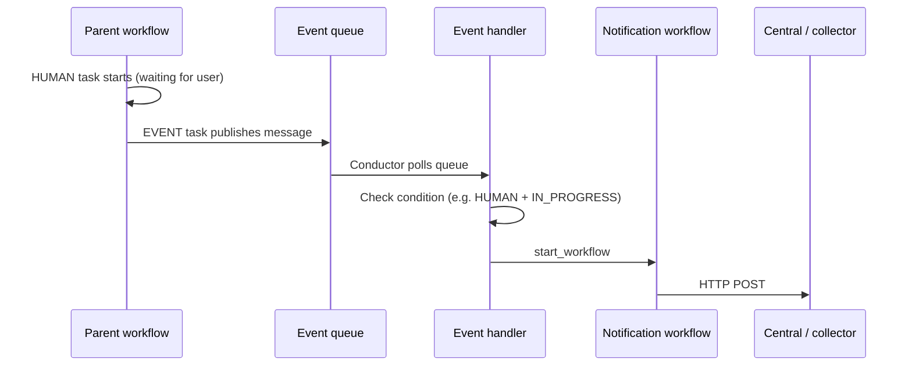

# Simple Task Notifications — Event Handler + HTTP Workflow

A workflow-only way to notify Central with the same payload shape as native SIMPLE task events (e.g. when a HUMAN or other system task needs attention).

---

## Idea in one sentence

**Parent workflow publishes an event → Event handler starts a small notification workflow → HTTP task POSTs to Central.**

No code changes in Conductor core. Everything is defined via workflows + one event handler.

---

## How it works



---

## Three things to register

| # | What | Purpose |
|---|------|---------|
| 1 | **Parent workflow** | Runs HUMAN + EVENT task that publishes the message |
| 2 | **Notification workflow** | One HTTP task that POSTs to Central |
| 3 | **Event handler** | Listens on the event queue and starts the notification workflow |

**Order:** Register (1) and (2) first, then (3).

---

## 1. Parent workflow (publish the event)

Use **FORK** so HUMAN and EVENT run in parallel:

- **Branch A:** HUMAN task (waits for approval)
- **Branch B:** EVENT task (publishes notification)

```json
{
  "name": "HumanTaskWorkflow",
  "version": 1,
  "ownerEmail": "you@example.com",
  "schemaVersion": 2,
  "inputParameters": ["accountId"],
  "tasks": [
    {
      "name": "fork_human_and_notify",
      "taskReferenceName": "fork_human_and_notify",
      "type": "FORK_JOIN",
      "forkTasks": [
        [
          {
            "name": "human_ref",
            "taskReferenceName": "human_ref",
            "type": "HUMAN",
            "inputParameters": {
              "accountId": "${workflow.input.accountId}"
            }
          }
        ],
        [
          {
            "name": "notify_ref",
            "taskReferenceName": "notify_ref",
            "type": "EVENT",
            "sink": "conductor:simple_task_notify",
            "startDelay": 1,
            "inputParameters": {
              "taskType": "HUMAN",
              "status": "IN_PROGRESS",
              "taskRefName": "human_ref",
              "taskId": "${human_ref.taskId}",
              "accountId": "${workflow.input.accountId}"
            }
          }
        ]
      ]
    },
    {
      "name": "join",
      "taskReferenceName": "join",
      "type": "JOIN",
      "joinOn": ["human_ref", "notify_ref"]
    }
  ]
}
```

**Important:** The EVENT `sink` is prefixed with the parent workflow name by Conductor. Use `conductor:simple_task_notify` in the EVENT task; the handler listens on:

```
conductor:HumanTaskWorkflow:simple_task_notify
```

`startDelay: 1` gives the HUMAN branch a moment to create the task so `${human_ref.taskId}` can resolve.

---

## 2. Notification workflow (HTTP → Central)

```json
{
  "name": "simple_task_notification_workflow",
  "version": 1,
  "ownerEmail": "you@example.com",
  "schemaVersion": 2,
  "inputParameters": ["accountId", "workflowId", "taskId", "taskRefName", "taskStatus", "taskType"],
  "tasks": [
    {
      "name": "post_to_central",
      "taskReferenceName": "post_to_central",
      "type": "HTTP",
      "inputParameters": {
        "http_request": {
          "uri": "https://<central-host>/<endpoint>",
          "method": "POST",
          "contentType": "application/json",
          "headers": {
            "Authorization": "Bearer ${CENTRAL_AUTH_TOKEN}",
            "x-request-id": "${workflow.workflowId}"
          },
          "body": {
            "account_id": "${workflow.input.accountId}",
            "payload_type": "conductor_task_status",
            "payload_version": "1.0",
            "payload": {
              "workflowId": "${workflow.input.workflowId}",
              "taskId": "${workflow.input.taskId}",
              "referenceTaskName": "${workflow.input.taskRefName}",
              "status": "${workflow.input.taskStatus}",
              "taskType": "${workflow.input.taskType}"
            }
          }
        }
      }
    }
  ]
}
```

- `${CENTRAL_AUTH_TOKEN}` — set as an **environment variable** on the Conductor server (resolved at task run time).
- The parent workflow is **not blocked** by this HTTP call — only the small notification workflow runs.

For smoke tests, use `https://httpbin.org/post` as the URI.

---

## 3. Event handler (glue)

```json
{
  "name": "simple_task_notification_handler",
  "event": "conductor:HumanTaskWorkflow:simple_task_notify",
  "condition": "$.taskType == 'HUMAN' && $.status == 'IN_PROGRESS'",
  "actions": [
    {
      "action": "start_workflow",
      "start_workflow": {
        "name": "simple_task_notification_workflow",
        "version": 1,
        "correlationId": "${workflowInstanceId}",
        "input": {
          "workflowId": "${workflowInstanceId}",
          "taskRefName": "${taskRefName}",
          "taskId": "${taskId}",
          "taskStatus": "${status}",
          "taskType": "${taskType}",
          "accountId": "${accountId}"
        }
      }
    }
  ],
  "active": true
}
```

| Field | Meaning |
|-------|---------|
| `event` | Must match EVENT task `sink` |
| `condition` | Filters messages (`$.field` syntax) |
| `start_workflow.input` | Maps event payload → notification workflow input (`${field}`) |

Register via: `POST /api/event`

---

## Where events are stored

Internal `conductor:` events use the same queue backend as the rest of Conductor (`QueueDAO`):

| `conductor.db.type` | Event queue backend |
|---------------------|---------------------|
| `postgres` | Postgres tables (poll) |
| `redis_standalone` | Redis dyno queues (poll) |

This is **not** in-memory pub-sub. External sinks (`kafka:`, `sqs:`) use their own broker instead.

Event processing is enabled by default:

```properties
conductor.event-queues.default.enabled=true
conductor.default-event-processor.enabled=true
```

---

## API quick reference

| Action | Endpoint |
|--------|----------|
| Register workflow | `POST /api/metadata/workflow` |
| Register event handler | `POST /api/event` |
| List event handlers | `GET /api/event` |
| Start parent workflow | `POST /api/workflow/HumanTaskWorkflow` |
| Complete HUMAN task | `POST /api/tasks` |

Example — register event handler:

```bash
curl -s -X POST "$CONDUCTOR_URL/api/event" \
  -H "Content-Type: application/json" \
  -d @event-handler.json
```

Example — start parent workflow:

```bash
curl -s -X POST "$CONDUCTOR_URL/api/workflow/HumanTaskWorkflow" \
  -H "Content-Type: application/json" \
  -d '{"name":"HumanTaskWorkflow","version":1,"input":{"accountId":"12345"}}'
```

---

## Data flow (field mapping)

```
Parent input          EVENT inputParameters       Event handler input          HTTP body
────────────          ─────────────────────       ───────────────────          ─────────
accountId        →    accountId              →    accountId               →    account_id
                      taskId (from human_ref) →   taskId                  →    payload.taskId
                      status: IN_PROGRESS    →    taskStatus              →    payload.status
(auto) workflowId →   workflowInstanceId   →    workflowId              →    payload.workflowId
```

Two substitution layers:

- **Event handler:** `${field}` from the event message JSON
- **HTTP task:** `${workflow.input.x}` from the started notification workflow

---

## Pros and cons

| Pros | Cons |
|------|------|
| No core code changes | Must add FORK + EVENT to each HUMAN workflow |
| Per-workflow control | Auth token via env var or workflow input |
| Fire-and-forget to Central | Payload built manually vs `TaskStatusPublisher` |
| Easy to test with httpbin | One extra workflow instance per notification |

---

## Simpler alternative (requires a small code change)

Enable **`TaskStatusPublisher`** and call `notifyTaskStatusListener()` when HUMAN tasks are scheduled in `WorkflowExecutorOps.scheduleTask()`:

- Token stays in `application.properties` (`headerPrefer` / `headerPreferValue`)
- No EVENT / handler / notification workflow per parent workflow
- Same Central envelope as other task status events

---

## Verification checklist

- [ ] Notification workflow registered
- [ ] Parent workflow registered (FORK + HUMAN + EVENT)
- [ ] Event handler registered with `"active": true`
- [ ] EVENT `sink` matches handler `event` string
- [ ] Central URL and auth configured on HTTP task
- [ ] Start a test run → EVENT completes, notification workflow starts, HTTP task succeeds
- [ ] Complete HUMAN via `POST /api/tasks` → parent workflow finishes
